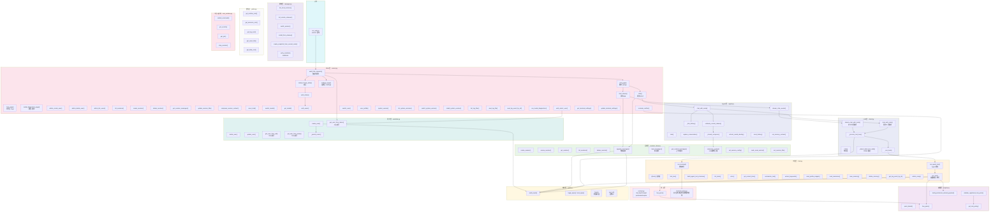

# TindaAgent 架构图

```mermaid
flowchart TB
    subgraph Entry[入口]
        run_web_py["run_web.py<br/>uvicorn 启动"]
    end

    subgraph Web[Web 层 · server.py]
        direction TB
        middleware["audit_http_requests()<br/>鉴权中间件"]
        index["index() / home_alias()<br/>首页"]
        settings_page["settings_page()<br/>设置页 /settings"]
        chat_page["chat_page()<br/>聊天页 /app"]
        logs_page["logs_page()<br/>日志页 /logs"]
        diagnostics_page["model_diagnostics_page()<br/>模型检测"]
        admin_create_user["admin_create_user()"]
        admin_delete_user["admin_delete_user()"]
        admin_list_users["admin_list_users()"]
        list_sessions["list_sessions()"]
        create_session["create_session()"]
        delete_session["delete_session()"]
        get_session_messages["get_session_messages()"]
        update_session_title["update_session_title()"]
        compress_session_context["compress_session_context()"]
        reset_chat["reset_chat()"]
        chat["chat()<br/>同步POST"]
        chat_stream["chat_stream()<br/>流式SSE"]
        switch_model["switch_model()"]
        get_model["get_model()"]
        auth_status["auth_status()"]
        auth_users["auth_users()"]
        auth_select_user["auth_select_user()"]
        switch_user["switch_user()"]
        user_profile["user_profile()"]
        system_version["system_version()"]
        list_system_versions["list_system_versions()"]
        switch_system_version["switch_system_version()"]
        install_system_version["install_system_version()"]
        list_log_files["list_log_files()"]
        read_log_file["read_log_file()"]
        read_log_event_by_id["read_log_event_by_id()"]
        run_model_diagnostics["run_model_diagnostics()"]
        terminal_confirm["terminal_confirm()"]
        get_terminal_settings["get_terminal_settings()"]
        update_terminal_settings["update_terminal_settings()"]
    end

    subgraph Agent[Agent 层 · agent.py]
        direction TB
        agent_chat["chat()"]
        agent_chat_with_meta["chat_with_meta()"]
        agent_stream["stream_chat_events()"]
        agent_trim["_trim_history()"]
        agent_replace["replace_conversation()"]
        agent_estimate["estimate_current_tokens()"]
        agent_compress["_should_compress()"]
        agent_refresh["refresh_model_identity()"]
        agent_reset["reset_history()"]
        agent_memory["set_memory_context()"]
    end

    subgraph LLM[LLM 层 · client.py]
        direction TB
        llm_chat["chat()<br/>纯对话"]
        llm_chat_tools["chat_with_tools()<br/>同步工具循环"]
        llm_stream_tools["stream_chat_with_tools()<br/>流式工具循环"]
        llm_tool_loop["_process_tool_loop()"]
        llm_run_tools["_run_tools()"]
        llm_dsml["_detect_dsml_tool_calls()<br/>DSML兼容"]
    end

    subgraph Tools[工具层 · tool.py]
        direction TB
        tool_reg["@tool() 注册器"]
        find_tool["find_tool()"]
        run_tool["run_tool()<br/>权限校验+执行"]
        run_agent_tool["run_agent_tool()<br/>Agent调度"]
        build_schemas["build_agent_tool_schemas()"]
        list_tools["list_tools()"]
        echo["echo()"]
        get_time["get_current_time()"]
        summarize["summarize_text()"]
        keywords["extract_keywords()"]
        profile["read_profile_snippet()"]
        memories["read_memories()"]
        save_mem["save_memory()"]
        delete_mem["delete_memory()"]
        run_terminal["run_terminal()<br/>终端执行"]
        get_log["get_log_event_by_id()"]
        admin_noop["admin_noop()"]
    end

    subgraph Session[会话层 · session_store.py]
        direction TB
        ss_create["create_session()"]
        ss_ensure["ensure_session()"]
        ss_get["get_session()"]
        ss_list["list_sessions()"]
        ss_delete["delete_session()"]
        ss_append["append_messages()<br/>增量追加"]
        ss_load["load_messages()<br/>热缓存"]
        ss_context["get_context_messages()<br/>上下文窗口"]
        ss_compress["compress_context()<br/>LLM摘要压缩"]
        ss_config["set_session_config()"]
        ss_reset["mark_reset_anchor()"]
        ss_title["set_session_title()"]
    end

    subgraph Security[安全层]
        direction TB
        sec_context["context.py<br/>SecurityPrincipal<br/>push/reset/require"]
        sec_has_perm["has_perm()"]
        sec_terminal["terminal_policy.py<br/>白名单/黑名单/系统操作检测"]
    end

    subgraph Permission[权限层 · engine.py]
        perm_labels["perm_labels()"]
        perm_has_perm["has_perm()"]
        perm_validate["validate_registered_tool_perm()"]
        perm_denied["build_permission_denied_payload()"]
        perm_policy["get_tool_policy()"]
    end

    subgraph Audit[审计层 · audit.py]
        audit_event["audit_event()"]
        audit_span["begin_span() / end_span()"]
        audit_flush["flush()<br/>批量刷盘"]
        audit_next["next_id()<br/>自增ID"]
    end

    subgraph User[用户层 · userdata.py]
        user_create["create_user()"]
        user_delete["delete_user()"]
        user_update["update_user()"]
        user_by_uid["get_user_from_uid()<br/>O(1)索引"]
        user_by_name["get_user_from_name()<br/>O(1)索引"]
        user_by_token["get_user_from_token()<br/>O(1)索引"]
        user_persist["_persist_users()"]
    end

    subgraph Version[版本层 · manager.py]
        ver_list_local["list_local_versions()"]
        ver_list_remote["list_remote_releases()"]
        ver_switch["switch_version()"]
        ver_install["install_from_release()"]
        ver_snapshot["create_snapshot_from_current_code()"]
        ver_verify["verify_manifest()<br/>Ed25519"]
    end

    subgraph Paths[路径层 · paths.py]
        path_runtime["get_runtime_root()"]
        path_sessions["get_sessions_root()"]
        path_log["get_log_root()"]
        path_users["get_users_file()"]
        path_data["get_data_root()"]
    end

    subgraph Runtime[工具运行时 · tool_runtime.py]
        tr_submit["submit_command()"]
        tr_events["get_events()"]
        tr_get_job["get_job()"]
        tr_stop["stop_session()"]
    end

    %% 主调用链
    run_web_py --> middleware
    middleware --> index
    middleware --> chat_page
    middleware --> settings_page
    index --> auth_status
    auth_status --> auth_users
    auth_select_user --> user_by_token

    chat_page --> chat
    chat_page --> chat_stream
    chat --> agent_chat_with_meta
    chat_stream --> agent_stream
    agent_chat_with_meta --> llm_chat_tools
    agent_stream --> llm_stream_tools
    llm_chat_tools --> llm_tool_loop
    llm_stream_tools --> llm_tool_loop
    llm_tool_loop --> llm_run_tools
    llm_run_tools --> run_agent_tool
    run_agent_tool --> run_tool
    run_tool --> sec_has_perm
    run_tool --> perm_has_perm
    run_terminal --> sec_terminal

    chat --> ss_append
    chat_stream --> ss_append
    ss_append --> audit_event

    agent_chat_with_meta --> agent_trim
    agent_chat_with_meta --> agent_estimate
    agent_estimate --> agent_compress
    agent_compress --> ss_compress

    %% 权限链
    sec_has_perm --> perm_has_perm
    perm_validate --> perm_policy
    run_tool --> perm_denied

    %% 用户链
    middleware --> user_by_token
    user_create --> user_persist

    %% 终端确认
    terminal_confirm --> run_terminal

    %% 所有层 → 审计
    llm_tool_loop --> audit_event
    run_tool --> audit_event
    ss_append --> audit_event
    user_create --> audit_event

    style Entry fill:#e0f7fa
    style Web fill:#fce4ec
    style Agent fill:#e8eaf6
    style LLM fill:#e8eaf6
    style Tools fill:#fff3e0
    style Session fill:#e8f5e9
    style Security fill:#ffebee
    style Permission fill:#f3e5f5
    style Audit fill:#fff8e1
    style User fill:#e0f2f1
    style Version fill:#ede7f6
    style Paths fill:#fafafa
    style Runtime fill:#fce4ec
```
