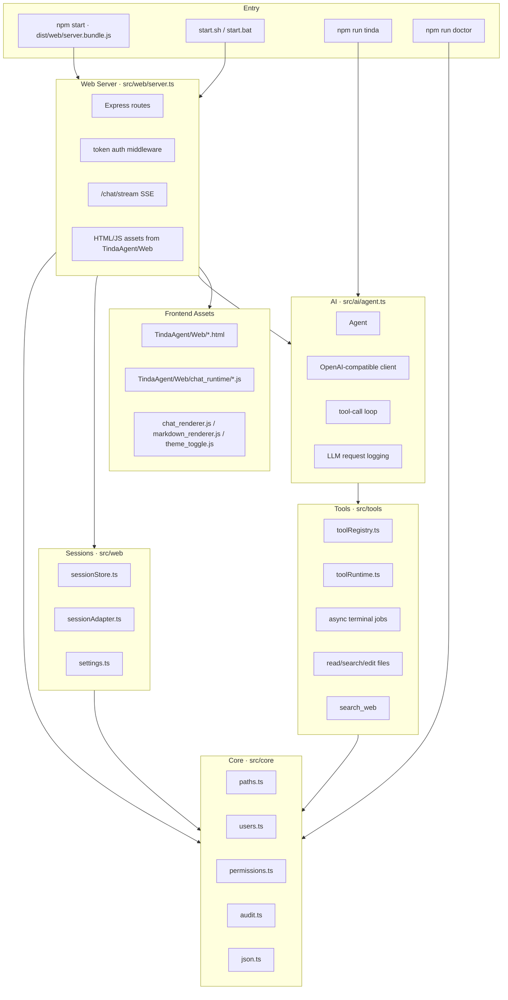

# TindaAgent Architecture

TindaAgent is now a TypeScript-first application. The Python stack has been
removed from the repository.

## Runtime Layers

## Data

- Runtime root: `TINDA_HOME` or `~/.tinda/agent`
- Users: `user/users.json`
- Sessions: `Data/Sessions`
- Logs: `log`
- Latest LLM request log: `log/llm_request.jsonl` unless `TINDA_LLM_REQUEST_LOG` is set

## Compatibility Surface

Existing frontend URLs are preserved:

- `/`
- `/app`
- `/chat`
- `/chat/stream`
- `/sessions`
- `/auth/*`
- `/terminal/*`
- `/logs`
- `/model-data`
- `/system/version`

The compatibility target is HTTP/API behavior and JSON storage shape, not Python
module imports.
